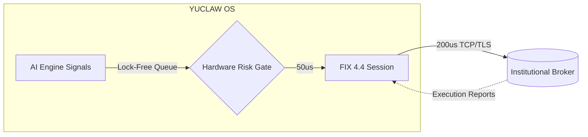

<div align="center">

# YUCLAW-EDGE

**C++ FIX Execution Gateway**


> Sub-millisecond order dispatch via the FIX 4.4 protocol. The ultra-low latency execution gateway bridging YUCLAW's adversarial AI-generated trade signals directly to broker and exchange endpoints.

</div>

---

## Overview

**Yuclaw-Edge** operates the critical "last mile" of automated trading. Engineered specifically for the ARM64 DGX Spark Blackwell architecture, it receives structured, cryptographically-verified orders from the core YUCLAW engine and dispatches them to institutional brokers with extreme precision.

By leveraging kernel-bypass networking and lock-free data structures, Yuclaw-Edge ensures that the alpha generated by your 120B local models touches the market with sub-millisecond latency.

---

## Core Capabilities

- **Sub-Millisecond Latency:** Kernel-bypass networking combined with lock-free order queues eliminates OS-level context switching and thread contention.
- **Graduated Execution (Levels 0-4):** Safely scale from Level 0 (Paper/Simulation) to Level 4 (Fully Autonomous Live Capital) using built-in deployment safeguards.
- **Hardware-Layer Risk Gates:** Pre-trade position limits, notional caps, and microsecond rate-throttling evaluated in < 50 us before any packet leaves the machine.
- **Robust FIX 4.4 Compliance:** Full session lifecycle management including Logon, Heartbeat, Test Requests, and Sequence Resets.
- **Replay and Fault Safe:** Deterministic message sequencing with automated gap-fill recovery ensures no orphaned orders during network volatility.
- **Multi-Venue Smart Routing:** Route and split orders across multiple broker endpoints via dynamic FIX sessions.

---

## Execution Architecture


---

## Supported FIX 4.4 Message Types

| FIX Tag | Message Type | Direction | Description |
|:---|:---|:---:|:---|
| 35=D | New Order Single | Outbound | Dispatches new trade to broker |
| 35=F | Order Cancel Request | Outbound | Requests termination of open order |
| 35=8 | Execution Report | Inbound | Confirms fills, partials, rejections |
| 35=9 | Order Cancel Reject | Inbound | Broker rejection of cancellation |
| 35=0 | Heartbeat | Both | Maintains active session health |

---

## Execution Levels

| Level | Name | Capital Limit | Requirements |
|:---|:---|:---:|:---|
| 0 | Paper Trading | $0 | Default — simulation only |
| 1 | Broker Test | $0 | Connection verified |
| 2 | Small Real | $1,000 | 7-day track record |
| 3 | Institutional | $100,000 | 30-day track record |
| 4 | Autonomous | Unlimited | 180-day track record |

---

## Configuration
```yaml
# config/edge_config.yaml
fix_session:
  sender_comp_id: YUCLAW
  target_comp_id: BROKER
  host: fix.broker.com
  port: 9876
  ssl: true

risk_limits:
  max_order_rate: 100/s
  max_notional: 10000000
  max_position_pct: 0.05
  execution_level: 0  # 0=Paper, 4=Autonomous
```

---

## Build Instructions
```bash
# Clone the repository
git clone https://github.com/YuClawLab/yuclaw-edge.git
cd yuclaw-edge

# Create build directory
mkdir build && cd build

# Configure for ARM64 DGX Spark
cmake .. -DCMAKE_BUILD_TYPE=Release

# Compile using all available cores
make -j$(nproc)

# Run paper trading test
./fix_gateway
```

---

## Ecosystem

| | |
|:---|:---|
| Dashboard | [yuclawlab.github.io/yuclaw-brain](https://yuclawlab.github.io/yuclaw-brain) |
| PyPI | [pypi.org/project/yuclaw](https://pypi.org/project/yuclaw) |
| GitHub | [YuClawLab](https://github.com/YuClawLab) |
| Paper | [SSRN #6461418](https://papers.ssrn.com/sol3/papers.cfm?abstract_id=6461418) |

---

<div align="center">

MIT License — free for everyone.

*Built on NVIDIA DGX Spark GB10 - ARM64 Blackwell - Zero cloud dependency*

</div>
